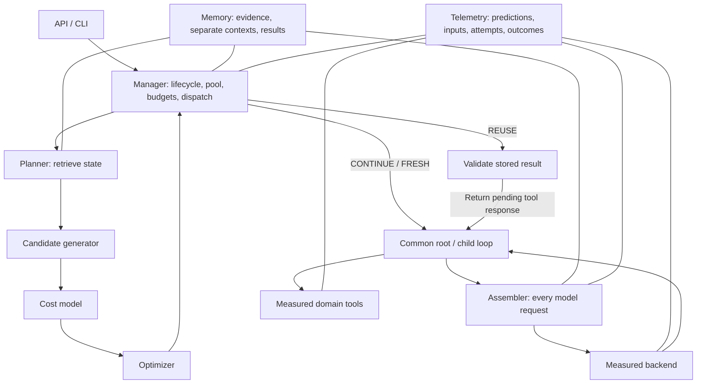

# Architecture and typed handoffs

One process owns one active run and one active operation. API handlers enqueue work; CLI uses the same `Manager`. The root pauses while a child executes. All components communicate through Python calls, not internal HTTP services.

## Ownership

`manager.py` owns run/operation state, the worker pool, cancellation, budgets, plan execution, result publication and parent delivery. It coordinates planning and assembly. `agent_loop.py` contains the shared protocol-valid model/tool loop, not a second planner. Per-worker role, permissions, history and budgets determine available actions.

`planner.py` retrieves bounded metadata and coordinates `candidates.py`, `cost_model.py`, and `optimizer.py`. The planner runs at operation boundaries and final-assembly invalidation. Ordinary continuation retains its selected plan. Changed active inputs cause a controlled stop; V1 does not repair contexts.

`assembler.py` renders the system instructions followed by append-only history and ordered selected evidence/assignments. Tools retain their original order. It assembles every actual model request, including retries and ordinary turns. The optional plan argument is `None` for ordinary root work and root integration. Preview assembly checks feasibility without recording an actual model attempt.

`memory.py` stores versions, current bindings, separate worker histories, prior results and record references. `artifacts.py` writes immutable payloads before database publication. SQLite never remains in a transaction across model/tool execution. `telemetry.py` is also usable independently of the planner.

## Interfaces

Persisted Pydantic records are in `contracts.py`; `ExecutionState` and `CandidateMatches` are typed in-process contexts in `state.py`.

| Interface | Contract |
| --- | --- |
| `MemoryStore.find_candidates(Operation, ExecutionState) → CandidateMatches` | Required references, bounded ranked metadata, eligible lookup candidates and binding revision |
| `CandidateGenerator.generate(Operation, ExecutionState, CandidateMatches) → list[CandidatePlan]` | At most five distinct applicable alternatives |
| `CostModel.estimate(Operation, ExecutionState, CandidatePlan) → Estimate` | Operation cost, separate latency, uncertainty, breakdown, sample count, provenance |
| `Optimizer.select(list[CandidatePlan], dict[str, Estimate], Limits) → CandidatePlan` | Cheapest known-feasible option, or `FeasibilityError` with logged rejections |
| `Assembler.assemble(Worker, CandidatePlan \| None, ExecutionState) → Assembled` | Exact request, tool schemas, token estimate, manifest and fingerprint; never changes selection |
| `Manager.execute(plan, operation, state, call_id, preflight=False)` | Validate and dispatch the selection, or controlled failure |
| `DomainAdapter` | Prepare task; prompts/tools; execution; source refresh; verification; artifact export |
| `ModelBackend.complete(request, context) → ModelResponse` | Normalized assistant message, raw provider usage, synthetic label |

Estimation and assembly use the same serialization and token-count function. Metadata evidence sizes are provisional. If final assembly changes input size by more than 10% (minimum 64 tokens), the manager reselects using the measured rendering estimate; at most twelve passes are allowed. Assembly failures exclude that alternative for the decision.

## Execution paths

- **REUSE:** validate a same-run, side-effect-free operation key and every source requirement; check the real parent's projected input; deliver the stored result. There is no child, child prompt, dummy worker or fabricated attempt. The following real root request is assembled and measured as integration.
- **CONTINUE current root:** close the pending request with an inline assignment and remain in the root loop until `complete_operation`. No extra integration call is fabricated.
- **CONTINUE prior child:** append the selected assignment/evidence to that child's compatible saved context. Acknowledge completion before saving its resumable state.
- **FRESH:** create a scoped child after feasibility checks. If the pool is full, archive the idle child with the lowest stable ID. Logical retirement says nothing about server caches.

The focused view contains required evidence plus at most two direct lexical matches within its budget. Broader adds bounded other corpus/source neighbors and includes focused evidence. Required evidence is never removed to fit a budget. An identical broader view is deduplicated.

## Inspect a complete operation

`examples/operation_handoff.json` comes from an executed synthetic demo. It includes the root operation request, candidate predictions, selected plan, exact child request/manifest, stored result, the root integration request, and predicted-versus-actual measurements. The same demo then reuses the result through the shorter path.

At runtime, inspect `/runs/{id}/trace`, `/runs/{id}/metrics`, or `econocontext export`. Reconstruct any actual request with `econocontext reconstruct MANIFEST_HASH`. Reconstructed inputs are exact retained requests; repeated model outputs or provider tokenization are not guaranteed.
